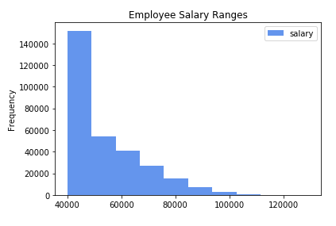
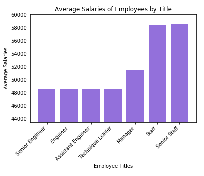

## sql-challenge
# Employee Database: A Mystery in Two Parts

## Overview

Employee data from the 1980s and 1990s was stored in six CSV files. In order to analyse this data more easily, the data needed to be imported into tables in a *PostgreSQL* database. Through data engineering, tables were designed to hold the employee data in those six CSV files, a SQL database was created in *PostgreSQL* to house those tables and data, and then the data was imported for data analysis.

Then as a bonus, the goal was to determine if the data is fake using a histogram and bar chart.

### Files

There are two folders in the main **sql-challenge** folder that hold files used in this challenge:

#### 1. data Folder

* [data](data/) - this folder contains the 6 CSV files of employee data used as the date source files 
    * [Departments](data/departments.csv) - the various departments of which an employee could be a member
    * [Department Employee](data/dept_emp.csv) - combines departments with employee numbers
    * [Department Managers](data/dept_manager.csv) - combines departments and their managers
    * [Employees](data/employees.csv) - the employees' data
    * [Salaries](data/salaries.csv) - salary data for the employees
    * [Titles](data/titles.csv) - the various titles an employee can have

#### 2. EmployeeSQL Folder

All the files that were created during this challenge are stored in this folder

* [Table Schemas](EmployeeSQL/schemas.sql) - this file has the scripts to create all the database tables including primary and foreign keys and some indexes
* [Queries](EmployeeSQL/queries.sql) - this file contains the scripts used for the analysis; each question is separated into its own query statement
* [ERD](EmployeeSQL/ERD.jpeg) - this file is an image of the database diagram created using *GenMyModel*
* **Jupyter Notebook** (EmployeeSQL/salaries.jpynb) - The Jupyter Notebook file that contains the scripts, histogram and bar chart for the **BONUS** section
* **config.py** (EmployeeSQL/config.py) - This file will have to be created by the user and saved in the **EmployeeSQL** folder. This file contains the password used to connect to the database from within the Jupyter Notebook

## Steps to Run the Scripts

The database created for this challenge is called **EmployeeSQL**. To create the tables, run the *schemas.sql* file in the order laid out in the file starting with the **Create tables** section. The table scripts should be run in the following order:
1. departments
2. titles
3. salaries
4. employees
5. dept_emp
6. dept_manager

After that portion of the script has been run, load the tables by importing the CSV files in the following order:
1. departments
2. salaries
3. titles
4. employees
5. dept_emp
6. dept_manager

Once all the data has been loaded into the SQL tables, the rest of the *schemas.sql* script can be run starting with the **Create FKs** section. Then follow that with running the **Create Indexes** section. That should get the tables ready for querying.

The queries in the *queries.sql* file can be run in any order as they are not dependent on one another. They are, however, listed in the order of the questions asked in this challenge.

## Bonus Section

The purpose of the *Bonus* section is to determine if the data is fake or not. To help determine this, a histogram and bar chart were created.

### Requirements

In order for the *Jupyter Notebook* to connect to the *PostgreSQL* database, some steps need to be taken first:
1. The database should be named `EmployeeSQL`.
2. The user name for this database is `postgres` so an account using that name must exist with access to the *EmployeeSQL* database.
3. Create a text file called config.py and save it in the *EmployeeSQL* folder. This file should have an entry of `postgres_key = ` and then the password used by the `postgres` account to connect to the *PostgreSQL* database.

### Analysis

After creating the histogram and seeing that most of the employees fell within the $40,000 - $50,000, which was the lowest salary range, that seemed a little perplexing.

To find out how those salaries broke out by title, a bar chart was then created.

## Notes

API keys are needed for the OpenWeatherMap and Google Places APIs. Both keys need to be in a file called **api_keys.py** and located in the **WeatherPy** and the ***VacationPy** folders. Keys should use the following variable names:
* OpenWeatherMap API: api_key
* Google Places API: g_key

I didn't have any cities with humidities greater than 100% but I coded that section in just in case that should happen with a future pull.

I created the function for plotting linear regressions but didn't actually use it. I created it after I had already completed everything else. Since my analysis was based on the data I had originally pulled, I didn't want to re-run everything to use the function and end up with different cities.

The heatmap and the heatmap with the marker layer for hotels show repeating world maps when they first run. You have to zoom in to see just one world map. The heatmap with the markers layer also doesn't fill the whole cell so scrolling is involved. I have not yet figured out why this is occurring and how to fix it. 

I ended up having cities that didn't pull a hotel name so I removed those rows from the dataframe before adding the marker layer.